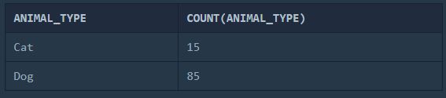
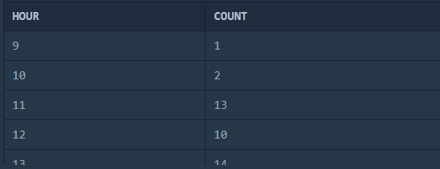

https://programmers.co.kr/learn/challenges

`ANIMAL_INS` 테이블은 동물 보호소에 들어온 동물의 정보를 담은 테이블입니다. `ANIMAL_INS` 테이블 구조는 다음과 같으며, 

`ANIMAL_ID`, `ANIMAL_TYPE`, `DATETIME`, `INTAKE_CONDITION`, `NAME`, `SEX_UPON_INTAKE`는 각각 동물의 아이디, 생물 종, 보호 시작일, 보호 시작 시 상태, 이름, 성별 및 중성화 여부를 나타냅니다.


## SELECT


> 모든 레코드 조회하기


모든 동물의 정보를 ANIMAL_ID 순으로 조회하기 

```SQL
SELECT * FROM ANIMAL_INS ORDER BY ANIMAL_ID ASC;
```


- SELECT * FROM ANIMAL_INS ORDER BY ANIMAL_ID ASC; 오름차순
- SELECT * FROM ANIMAL_INS ORDER BY ANIMAL_ID DESC; 내림차순


> 역순 정렬하기


동물 보호소에 들어온 모든 동물의 이름과 보호 시작일을 조회하는 SQL문을 작성해주세요. 이때 결과는 ANIMAL_ID 역순으로 보여주세요. 

```SQL
SELECT NAME, DATETIME FROM ANIMAL_INS ORDER BY ANIMAL_ID DESC;
```


> 아픈 동물 찾기


동물 보호소에 들어온 동물 중 아픈 동물의 아이디와 이름을 조회하는 SQL 문을 작성해주세요. 이때 결과는 아이디 순으로 조회해주세요.

```SQL
SELECT ANIMAL_ID, NAME FROM ANIMAL_INS 
WHERE INTAKE_CONDITION LIKE "sick" 
ORDER BY ANIMAL_ID ASC;
```


> 어린 동물 찾기


동물 보호소에 들어온 동물 중 젊은 동물[1](https://programmers.co.kr/learn/courses/30/lessons/59037?language=mysql#fn1)의 아이디와 이름을 조회하는 SQL 문을 작성해주세요. 이때 결과는 아이디 순으로 조회해주세요.

```SQL
SELECT ANIMAL_ID, NAME FROM ANIMAL_INS 
WHERE INTAKE_CONDITION 
NOT LIKE "Aged";
```


> 동물의 아이디와 이름


아이디와 이름 모두 오름차순으로 조회해주세요.

```SQL
SELECT ANIMAL_ID, NAME FROM ANIMAL_INS 
ORDER BY ANIMAL_ID, NAME ASC;
```


> 여러 기준으로 정렬하기


동물 보호소에 들어온 모든 동물의 아이디와 이름, 보호 시작일을 이름 순으로 조회하는 SQL문을 작성해주세요.

 단, 이름이 같은 동물 중에서는 보호를 나중에 시작한 동물을 먼저 보여줘야 합니다.


```SQL
SELECT ANIMAL_ID, NAME, DATETIME FROM ANIMAL_INS 
ORDER BY NAME ASC, DATETIME DESC;
```


- ORDER BY <필드명> ASC, <필드명> DESC 이런식으로 여러 기준으로 정렬이 가능하다.


> 상위 n개 레코드


동물 보호소에 가장 먼저 들어온 동물의 이름을 조회하는 SQL 문

```SQL
SELECT NAME FROM ANIMAL_INS 
ORDER BY DATETIME ASC 
LIMIT 1;
```


## SUM, MAX, MIN

> 최대값 구하기


가장 최근에 들어온 동물은 언제 들어왔는지 조회하는 SQL 문

```SQL
SELECT MAX(DATETIME) FROM ANIMAL_INS;
```


> 최솟값 구하기


가장 늦게 들어온 동물은 언제 들어왔는지 조회하는 SQL 문

```SQL
SELECT MIN(DATETIME) FROM ANIMAL_INS;
```


> 동물 수 구하기


```SQL
SELECT COUNT(*) FROM ANIMAL_INS;
```


> 중복 제거하기


```SQL
SELECT COUNT(DISTINCT NAME) FROM ANIMAL_INS;
```


- `DISTINCT` 키워드를 필드명 앞에 붙여주면 중복이 제거된 정보를 조회할 수 있고, 이를 괄호로 감싸 `COUNT` 키워드를 붙여주면 해당 필드의 개수를 세어준다.


## GROUP BY

> 고양이와 개는 몇 마리 있을까


```SQL
SELECT ANIMAL_TYPE, COUNT(ANIMAL_TYPE) FROM ANIMAL_INS
GROUP BY ANIMAL_TYPE;
```




> 동명 동물 수 찾기


동물 보호소에 들어온 동물 이름 중 두 번 이상 쓰인 이름과 해당 이름이 쓰인 횟수를 조회하는 SQL문을 작성해주세요. 이때 결과는 이름이 없는 동물은 집계에서 제외하며, 결과는 이름 순으로 조회해주세요.

```SQL
SELECT NAME, COUNT(NAME) FROM ANIMAL_INS 
GROUP BY NAME 
HAVING COUNT(NAME) >= 2;
```


- GROUP BY와 HAVING은 함께 쓰인다.


> 입양 시각 구하기(1)


보호소에서는 몇 시에 입양이 가장 활발하게 일어나는지 알아보려 합니다. 9시부터 19시까지, 각 시간대별로 입양이 몇 건이나 발생했는지 조회하는 SQL문을 작성해주세요. 이때 결과는 시간대 순으로 정렬해야 합니다.

```SQL
SELECT HOUR(DATETIME) AS HOUR, # AS로 필드명을 변경할 수 있다.
COUNT(HOUR(DATETIME)) AS COUNT 
FROM ANIMAL_OUTS

WHERE HOUR(DATETIME) >= 9 
AND HOUR(DATETIME) <= 19

GROUP BY HOUR(DATETIME);
```




> 입양 시각 구하기(2)


보호소에서는 몇 시에 입양이 가장 활발하게 일어나는지 알아보려 합니다. 0시부터 23시까지, 각 시간대별로 입양이 몇 건이나 발생했는지 조회하는 SQL문을 작성해주세요. 이때 결과는 시간대 순으로 정렬해야 합니다.

```SQL
SET @HOUR_LIST = -1; # 변수를 -1로 선언한다.

SELECT (@HOUR_LIST := @HOUR_LIST + 1) AS 'HOUR', 
# +1씩 해준다.
(SELECT COUNT(*) FROM ANIMAL_OUTS WHERE HOUR(DATETIME) = @HOUR_LIST) AS 'COUNTS' 
# 0부터 23까지 쭉 WHERE로 돌면서 해당 필드를 COUNT한다.
# 그러면 GROUP BY로 했을때 돌지못하는(==카운트할 데이터가 없는)
# 것에 대한 정보를 얻을 수 있다.
FROM ANIMAL_OUTS 
WHERE @HOUR_LIST < 23; 
```

SET으로 HOUR_LIST라는 변수를 선언하고 +1 씩 하며 0~23시 까지 모든 시간에 대한 COUNT를 출력


## IS NULL


> 이름이 없는 동물의 아이디


```SQL
SELECT ANIMAL_ID FROM ANIMAL_INS
WHERE  NAME IS NULL;
```

* `NULL`은 `IS NULL`, `IS NOT NULL` 연산자를 통해서만 비교가 된다.


> 이름이 있는 동물의 아이디


```SQL
SELECT ANIMAL_ID FROM ANIMAL_INS 
WHERE NAME IS NOT NULL # 먼저 IS NOT NULL인 애들로 가져온 후
ORDER BY ANIMAL_ID ASC; # 오름차순으로 정렬해준다. 
```


> NULL 처리하기


입양 게시판에 동물 정보를 게시하려 합니다. 동물의 생물 종, 이름, 성별 및 중성화 여부를 아이디 순으로 조회하는 SQL문을 작성해주세요. 이때 프로그래밍을 모르는 사람들은 NULL이라는 기호를 모르기 때문에, 이름이 없는 동물의 이름은 No name으로 표시해 주세요.

```SQL
SELECT ANIMAL_TYPE, IFNULL(NAME, "No name") AS NAME,  SEX_UPON_INTAKE
# 만약 NULL이라면 NAME을 "No name"으로 변경한다.
FROM ANIMAL_INS;
```


## JOIN

`ANIMAL_OUTS` 테이블은 동물 보호소에서 입양 보낸 동물의 정보를 담은 테이블입니다. `ANIMAL_OUTS` 테이블 구조는 다음과 같으며, `ANIMAL_ID`, `ANIMAL_TYPE`, `DATETIME`, `NAME`, `SEX_UPON_OUTCOME`는 각각 동물의 아이디, 생물 종, 입양일, 이름, 성별 및 중성화 여부를 나타냅니다. `ANIMAL_OUTS` 테이블의 `ANIMAL_ID`는 `ANIMAL_INS`의 `ANIMAL_ID`의 외래 키입니다.


> 없어진 기록 찾기


천재지변으로 인해 일부 데이터가 유실되었습니다. `ANIMAL_OUTS` 입양을 간 기록은 있는데, 보호소에 들어온 기록이 없는 동물의 ID와 이름을 ID 순으로 조회하는 SQL문을 작성해주세요.

```SQL
SELECT A.ANIMAL_ID, A.NAME
FROM ANIMAL_OUTS A LEFT JOIN ANIMAL_INS B
ON A.ANIMAL_ID = B.ANIMAL_ID
-- B의 ANIMAL_ID가 NULL이다 == 유실된 것이다.
WHERE B.ANIMAL_ID IS NULL
ORDER BY A.ANIMAL_ID ASC;
```


> 있었는데요 없었습니다.


관리자의 실수로 일부 동물의 입양일이 잘못 입력되었습니다. 보호 시작일보다 입양일이 더 빠른 동물의 아이디와 이름을 조회하는 SQL문을 작성해주세요. 이때 결과는 보호 시작일이 빠른 순으로 조회해야합니다

1. ANIMAL_INS를 기준으로 ANIMAL_ID와 NAME 정보를 가져온다.
2. ANIMAL_ID를 기준으로 병합한다
3. DATETIME이 이상한 것을 찾는다.


```SQL
SELECT B.ANIMAL_ID, B.NAME 
FROM ANIMAL_INS B LEFT JOIN ANIMAL_OUTS A
ON B.ANIMAL_ID = A.ANIMAL_ID
WHERE A.DATETIME < B.DATETIME # 보호일이 더 크다는 말은, 더 최신이라는 뜻이다. 보호일은 입양일보다 최신일 수 없으므로 잘못된 정보가 저장되었다.
ORDER BY B.DATETIME;
```


>오랜 기간 보호한 동물(1)


아직 입양을 못 간 동물 중, 가장 오래 보호소에 있었던 동물 3마리의 이름과 보호 시작일을 조회하는 SQL문을 작성해주세요. 이때 결과는 보호 시작일 순으로 조회해야 합니다.


1. ANIMAL_INS를 기준으로 NAME과 DATETIME을 가져온다.

2. ANIMAL_OUTS과 JOIN하는데, ANIMAL_OUTS에 똑같이 있는 것을 제외하고 가져온다.

   -- 차집합을 가져온다.

   

3. 가장 오래 보호소에 있는 동물 3마리를 가져오고, 보호 시작일 순으로 조회한다.

```SQL
SELECT A.NAME, A.DATETIME
FROM ANIMAL_INS A LEFT JOIN ANIMAL_OUTS B 
ON A.ANIMAL_ID = B.ANIMAL_ID
WHERE B.DATETIME IS NULL # B에 정보가 없으면 입양을 가지 못했다는 뜻이 된다.
ORDER BY A.DATETIME ASC
LIMIT 3;
```


> 보호소에서 중성화한 동물


보호소에서 중성화 수술을 거친 동물 정보를 알아보려 합니다. 보호소에 들어올 당시에는 중성화[1](https://programmers.co.kr/learn/courses/30/lessons/59045#fn1)되지 않았지만, 보호소를 나갈 당시에는 중성화된 동물의 아이디와 생물 종, 이름을 조회하는 아이디 순으로 조회하는 SQL 문을 작성해주세요.


1. `SEX_UPON_OUTCOME` 중성화여부, 보호소에서 중성화되지 않았지만, 입양 후 중성화된 동물을 가져온다.

   `Intact` 중성화 되지않음

   `Neutered`, `Spayed`  중성화됨 

   `Intact` 였다가 `Neutered` or `Spayed`로 상태가 변경된 경우를 말한다.

2. 아이디와 생물종, 이름을 조회한다.

3. 아이디 순으로 조회한다.


```SQL
SELECT A.ANIMAL_ID, A.ANIMAL_TYPE, A.NAME 
FROM ANIMAL_INS A LEFT JOIN ANIMAL_OUTS B
ON A.ANIMAL_ID = B.ANIMAL_ID
WHERE A.SEX_UPON_INTAKE LIKE "Intact%" # Intact이고
AND B.SEX_UPON_OUTCOME NOT LIKE "Intact%"; # 더이상 Intact가 아닌 것을 조회한다. (중성화 되었다는 의미가 된다.)
```


## String, Date


> 루시와 엘라 찾기


동물 보호소에 들어온 동물 중 이름이 Lucy, Ella, Pickle, Rogan, Sabrina, Mitty인 동물의 아이디와 이름, 성별을 조회하는 SQL 문을 작성해주세요.

```SQL
SELECT ANIMAL_ID, NAME, SEX_UPON_INTAKE 
FROM ANIMAL_INS
WHERE NAME = "Lucy" 
OR NAME = "Ella" 
OR NAME = "Pickle"
OR NAME = "Rogan"
OR NAME = "Sabrina"
OR NAME = "Mitty";
```


> 이름에 el이 들어가는 동물 찾기


보호소에 돌아가신 할머니가 기르던 개를 찾는 사람이 찾아왔습니다. 이 사람이 말하길 할머니가 기르던 개는 이름에 'el'이 들어간다고 합니다. 동물 보호소에 들어온 동물 이름 중, 이름에 EL이 들어가는 개의 아이디와 이름을 조회하는 SQL문을 작성해주세요. 이때 결과는 이름 순으로 조회해주세요. 단, 이름의 대소문자는 구분하지 않습니다.

1. ANIMAL_INS에서 ANIMAL_ID와 NAME을 조회하는데,
2. NAME에서 EL이 들어가는 것을 조회하고,
3. ANIMAL_TYPE이 Dog 인 것을 조회한다.
4. 그리고 NAME 순으로 조회한다.

```SQL
SELECT ANIMAL_ID, NAME FROM ANIMAL_INS
WHERE NAME LIKE '%EL%' AND
ANIMAL_TYPE = 'Dog'
ORDER BY NAME;
```


> 중성화 여부 파악하기


보호소의 동물이 중성화되었는지 아닌지 파악하려 합니다. 중성화된 동물은 `SEX_UPON_INTAKE` 컬럼에 'Neutered' 또는 'Spayed'라는 단어가 들어있습니다. 동물의 아이디와 이름, 중성화 여부를 아이디 순으로 조회하는 SQL문을 작성해주세요. 이때 중성화가 되어있다면 'O', 아니라면 'X'라고 표시해주세요.

```SQL
SELECT ANIMAL_ID, NAME, 
CASE 
WHEN SEX_UPON_INTAKE LIKE 'Intact%' THEN 'X' ELSE 'O'
END AS '중성화'
FROM ANIMAL_INS;
```


> 오랜 기간 보호한 동물(2)


입양을 간 동물 중, 보호 기간이 가장 길었던 동물 두 마리의 아이디와 이름을 조회하는 SQL문을 작성해주세요. 이때 결과는 보호 기간이 긴 순으로 조회해야 합니다


1. DATETIME이 둘다 존재하는 교집합인 데이터를 조회한다.
2. ANIMAL_OUTS의 데이터가 존재한다면, 입양 간 동물이라고 할 수 있다.
3. 그리고, 입양날짜 - 보호날짜를 해주면, 보호기간이 나온다.
4. 이를 내림차순으로 정렬 후
5. 위에서 2마리만 조회한다.


```SQL
SELECT A.ANIMAL_ID, A.NAME
FROM ANIMAL_INS A LEFT JOIN ANIMAL_OUTS B
ON A.ANIMAL_ID = B.ANIMAL_ID
-- JOIN ~ ON 맞춰준다.
WHERE B.DATETIME IS NOT NULL
ORDER BY (B.DATETIME-A.DATETIME) DESC
LIMIT 2;
```


> DATETIME에서 DATE로 형 변환


```SQL
SELECT ANIMAL_ID, NAME, 
DATE_FORMAT(DATETIME, '%Y-%m-%d') AS 날짜
--DATE_FORMAT(필드명, FORMATTING) AS 새로운필드명
FROM ANIMAL_INS;
```

